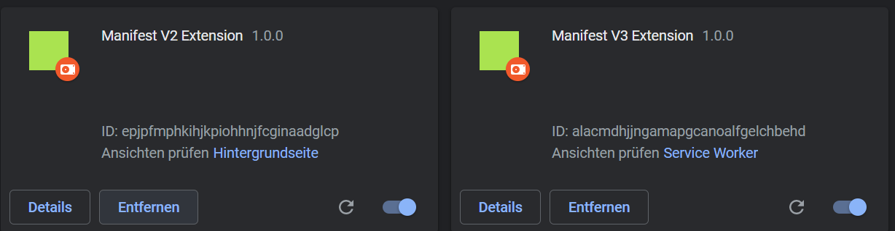

# Manifest V2/V3 Extensions

> This project is a boilerplate project to allow you to quickly build an manifest v2 or v3  extensions using TypeScript.

## Commands

| Command                 | Description                                           |
| -------------           | -------------                                         |
| build                   | Compile all files minified for Manifest V2 and V3     |
| build-mf2 \| build-mf3  | Compile all files minified for Manifest V2 or V3      |
| dev                     | Compile all files not minified for Manifest V2 and V3 |
| dev-mf2 \| dev-mf3      | Compile all files not minified for Manifest V2 or V3  |
| watch-mf2 \| watch-mf3  | Run the dev task in watch mode for Manifest V2 or V3  |

## Building

1.  Clone repo
2.  `npm install`
3.  `npm run dev-<mf2|mf3>` to compile once or `npm run watch-<mf2|mf3>` to run the dev task in watch mode
4.  `npm run build-<mf2|mf3>` to build a production (minified) version

## Installation

1.  Complete the steps to build the project above
2.  Go to [_chrome://extensions_](chrome://extensions) in Google Chrome
3.  With the developer mode checkbox ticked, click **Load unpacked extension...** and select the _dist_ folder from each build dist/<mf2/mf3>.

## Manifest V3
  * Open [_chrome://inspect/#service-workers_](chrome://inspect/#service-workers) or [_chrome://serviceworker-internals_](chrome://serviceworker-internals) to verify service worker activity and get access to the service worker background page

## Useful links
  * [Introduction about Manifest V3](https://developer.chrome.com/docs/extensions/mv3/intro/)
  * [Manifest V3 Migration Checklist](https://developer.chrome.com/docs/extensions/mv3/mv3-migration-checklist/)